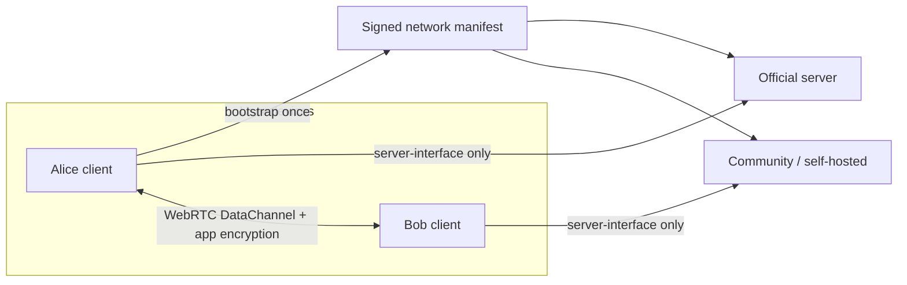
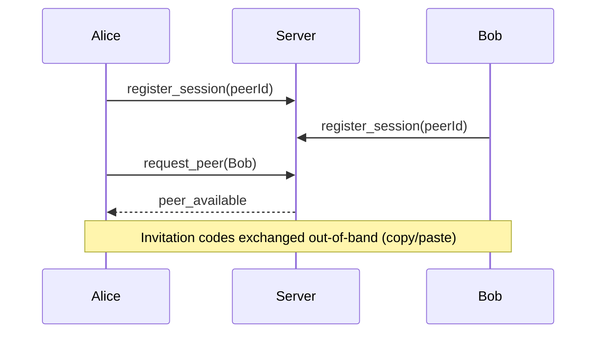
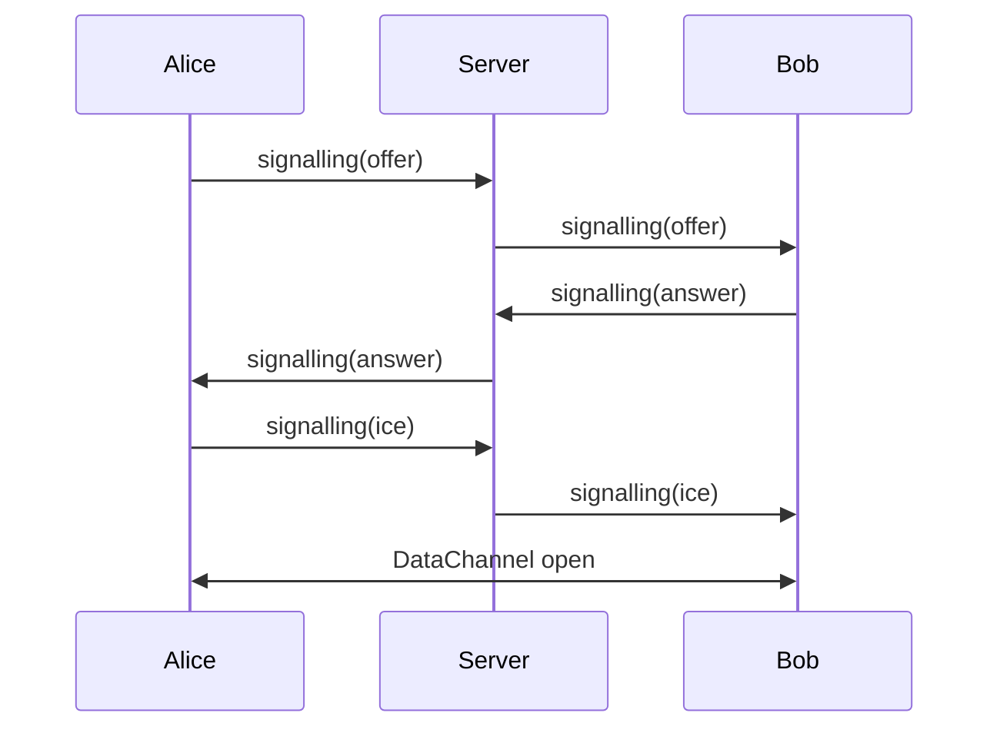
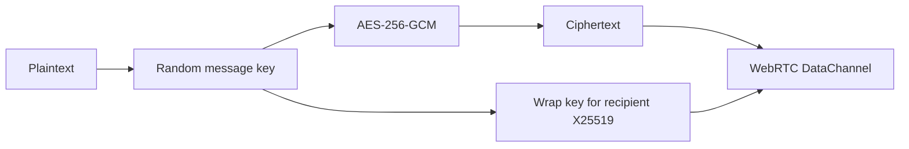
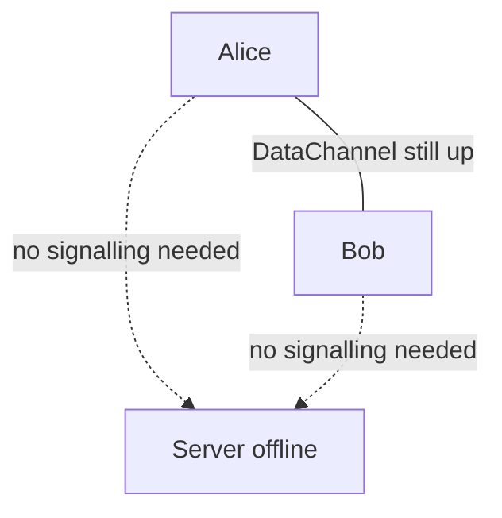
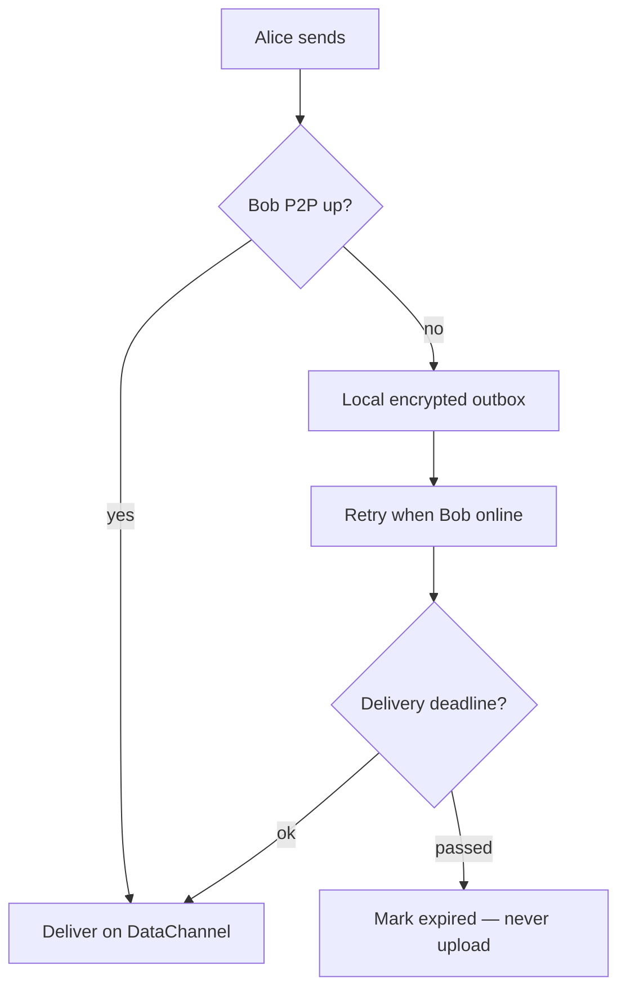
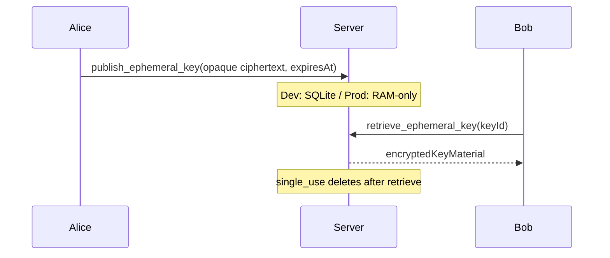
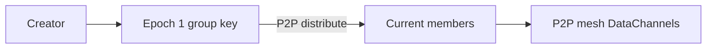
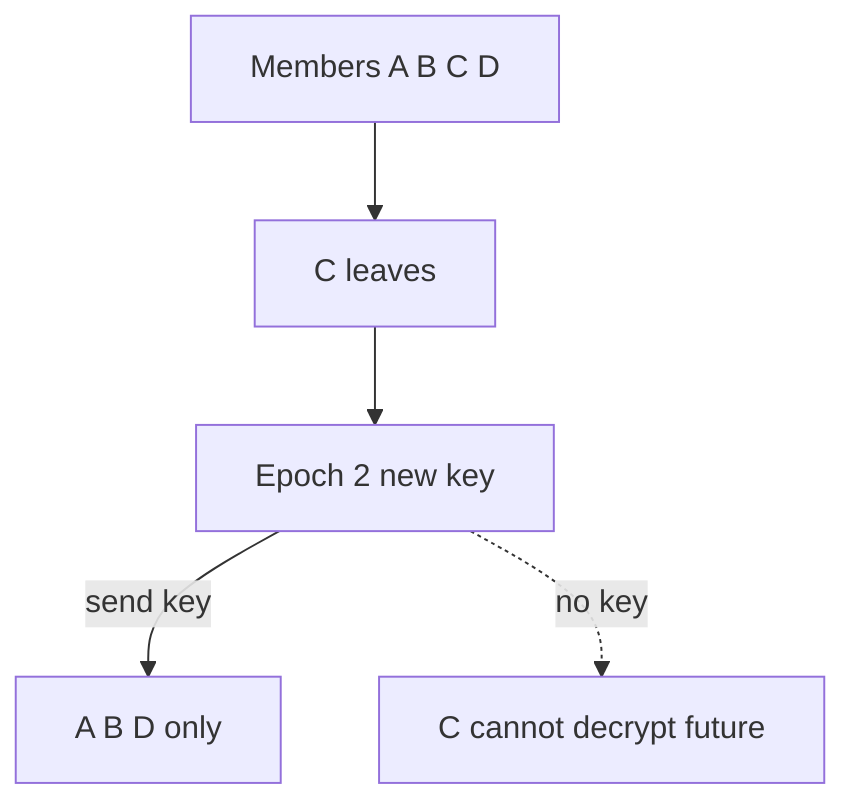
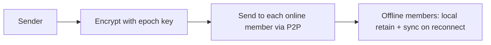

# Architecture

ZeroTrustChat is a prototype proving that useful chat can work when:

1. Devices are authoritative for identities, keys, contacts, messages, and groups.
2. The central server is rendezvous/signalling only.
3. All client↔server traffic crosses one small auditable package: `@ztc/server-interface`.

## High-level

## 1. Initial rendezvous

## 2. WebRTC connection

## 3. Direct messaging

The server never sees plaintext or message keys in the clear as chat content.

## 4. Server disconnect

Once P2P is established, signalling can drop and chat continues (until NAT/network forces reconnect).

## 5. Offline message behaviour

**There is no server mailbox.**

## 6. Message expiry

- **Delivery deadline**: stop attempting send.
- **Retention deadline**: delete local ciphertext + key material.
- Independent timers.

## 7. Ephemeral server keys

Not message storage — opaque key material only.

## 8. Group formation

Prototype historically used a full mesh for small groups. Large-group delivery now uses a **shared connection pool**, **gossip + compressed digests**, **signed epoch key-wrap**, and **soft helper preference within the degree budget** — see [Distributed group chat](distributed-group-chat.md). MLS and push tickles remain future work.

## 9. Group membership changes

New members do not receive old epoch keys → no automatic history access.

## 10. Group message delivery

**Prototype (updated):** sender fans out to a small set of live pool neighbors; gossip + digest anti-entropy repair the rest. Soft helper ranking (capability ads on existing edges only) and signed epoch key-wrap are implemented — see [Distributed group chat](distributed-group-chat.md). MLS and push tickles remain out of scope.

## Package boundaries

| Package | May use network? |
|---------|------------------|
| `@ztc/server-interface` | **Yes** (only) |
| `@ztc/crypto` | No |
| `@ztc/protocol` | No |
| Client chat/contacts/messages/groups | No — call server-interface |
| Server | Is the infrastructure |

## Group encryption (prototype)

The prototype uses a **shared AES-256-GCM group key per cryptographic epoch**:

1. On create / membership change, a new random epoch key is generated.
2. The key is distributed to *current* members over existing P2P DataChannels.
3. Removed members do not receive the new key and cannot decrypt future messages.
4. New members do not receive old epoch keys → no automatic history access.

**Must strengthen for production:**

- Replace ad-hoc key distribution with MLS (or similar continuous group key agreement).
- Persist prior epoch keys only under explicit policy; currently only the current epoch key is kept locally.
- Handle concurrent membership changes and partitions.
- Forward secrecy beyond simple epoch rotation.
- Soft helpers today are preference-within-budget only (no election/rotation beyond pool ranking).
- Scale further using the [distributed group chat design](distributed-group-chat.md).
