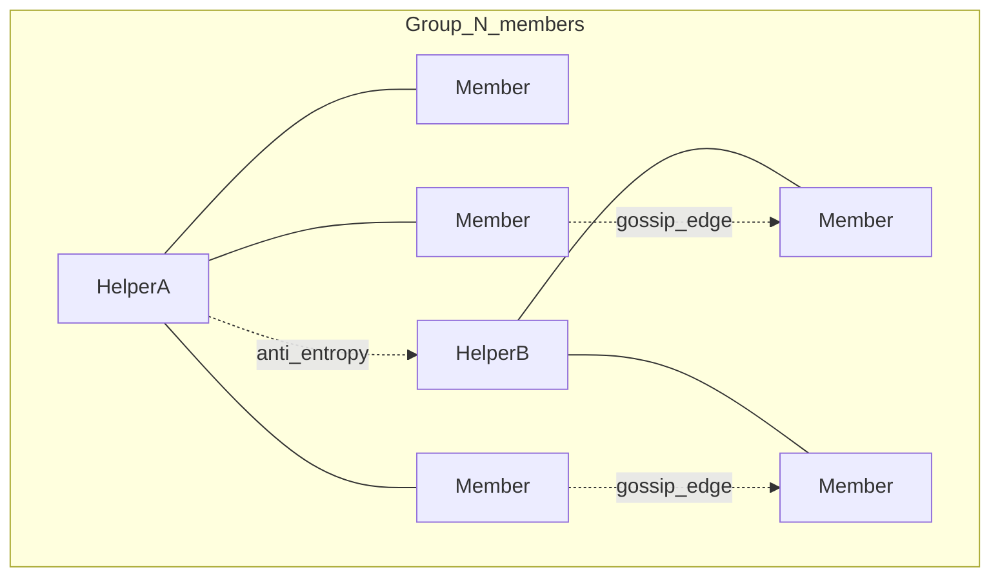

# Distributed group chat (design)

Design proposal for large groups (≈50–500+ members) without full-mesh P2P or central message distribution.

**Status:** design only. The running prototype still uses full fan-out (see [Current prototype](#current-prototype-what-breaks-at-scale)). Protocol implementation is deferred until explicitly requested.

**Core principle:** do not optimise for instant synchronisation. A group should normally converge within ~2–3 minutes. That delay is an intentional trade-off for lower server load, bandwidth, battery use, attack surface, and dependence on central infrastructure.

## Current prototype (what breaks at scale)

Today groups are a **full fan-out mesh** (`apps/client/src/lib/groups.ts`):

- `sendGroupMessage` encrypts once, then `p2p.send` to **every** other member.
- `distributeEpoch` does the same for keys.
- `P2pManager` keeps **one `RTCPeerConnection` per peer** with no degree cap (`apps/client/src/lib/p2p.ts`).
- Reconnect repair is push-only: last **50** ciphertexts via `group_sync` (no gap detection / have-want).
- Crypto is a **shared AES-256-GCM epoch key** rotated on membership change (`packages/crypto`); epoch payloads are unsigned; only the current epoch key is kept locally.

That is correct for tiny prototype groups and wrong for ~100 members (≈99 DataChannels × signalling load on the central server).

Central infrastructure already matches the intended role (signalling / presence / opaque ephemeral keys / rare `relay_packet`) via `@ztc/server-interface`. Group traffic must **not** become a new mailbox there.

## Goals and non-goals

### Goals

- Converge a group in ~2–3 minutes under normal conditions (not instant IM).
- Bound **P2P degree** per device (target ≈ 4–8 live DataChannels for group gossip, independent of group size).
- Bound **central-server work** to discovery/signalling for those few edges — O(degree), not O(N²).
- Preserve E2E encryption, device-owned history, cryptographic membership/epochs, no permanent central group store.
- Treat “Synchronising… 97/100” as healthy UI, not an error.

### Non-goals

- Perfect real-time ordering or instant delivery.
- DHT / blockchain / consensus / cryptocurrency.
- Server-side group history, contacts, or membership DB as source of truth.
- Permanent designated “group server” among members.
- Full MLS in the first cut (roadmap only).

## Approach comparison

| Criterion | A. Partial mesh flood | B. Pure gossip / epidemic | C. Temporary member relays | D. Hybrid (recommended) |
|-----------|----------------------|---------------------------|----------------------------|-------------------------|
| Connections / device | Low–medium (fixed k) | Low (fixed fanout + periodic peers) | Medium (spoke to relays) | Low (sparse mesh + 1–2 helpers) |
| Bandwidth | Medium–high (redundant floods) | Low–medium (fanout + anti-entropy) | Low for leaves; high on relays | Low–medium, load-aware |
| Central infra | Signalling only | Signalling only | Signalling only | Signalling only |
| Persistent server state | None for messages | None | None | None |
| Protocol complexity | Low | Medium | Medium (election) | Medium (bounded) |
| Mobile / NAT | Weak (unstable edges) | Medium | Strong if helpers are reachable | Strong |
| Hotspot risk | Low | Low | High if election sticky | Soft helpers + rotation |
| Fits 2–3 min converge | Yes | Excellent | Yes | Excellent |
| Privacy vs central | Good | Good | Good | Good |
| Failure / partition heal | Weak without repair | Strong with anti-entropy | Needs re-election + repair | Strong |

**Verdict**

- **A alone:** too little repair; partitions leave permanent gaps.
- **B alone:** right consistency model; weak for phones behind hard NAT that cannot hold many edges.
- **C alone:** recreates mini-servers and battery unfairness unless carefully temporary.
- **D (recommended):** epidemic gossip on a **sparse partial mesh**, plus **soft temporary helpers** for reachability — matches the project’s “eventual, not instant” philosophy with minimal central work.



Central server stays **outside** this graph except for establishing the few WebRTC edges.

## Recommended architecture: epidemic sparse mesh + soft helpers

### 1. Topology (connection budget)

Device-wide budget (not per-group): keep at most **K ≈ 6–8** open DataChannels used for group gossip.

Per large group, each online member maintains:

- **1–2 helper edges** (if helpers exist and are reachable).
- **2–4 gossip edges** to other members chosen by a deterministic + random mix (stable under churn, not a clique).

Selection score (local, never uploaded as a ranking DB):

- Already connected / shared across multiple groups (amortize signalling).
- Recent reliability (ack / anti-entropy success).
- Reachability hint (prior host/srflx success).
- Local capability flags exchanged **among members over P2P** (battery, mobile, `canAcceptInbound`).
- Hash(`groupId || peerId || timeBucket`) for rotation so load is not sticky.

If a peer cannot accept more edges, refuse politely; the requester picks the next candidate. No permanent “you are the server.”

**Out of scope for central server:** storing the mesh graph or choosing helpers. Server may only expose existing presence / `requestPeer` / signalling.

### 2. Soft temporary helpers (not relays of plaintext)

Helpers are **ordinary members** who temporarily:

- Accept a slightly higher inbound degree.
- Keep a **short TTL ciphertext cache** (same retention rules as local history; default aligned with security mode, e.g. hours–days for Normal).
- Answer **have/want** requests for missing message IDs.

They are **not**:

- Authoritative for membership or ordering.
- Allowed to see plaintext beyond what membership already grants (they already hold the epoch key).
- Permanently assigned — rotate on a time bucket (e.g. 10–15 min) and on disconnect.

**Election (no consensus protocol):** every member computes the same ordered candidate list from `hash(groupId || epoch || timeBucket || peerId)` filtered by advertised capability, then takes top **H ≈ 2–3** who are currently reachable. If a helper disappears, the next candidates in the list fill in; anti-entropy heals gaps.

Compromised helper ⇒ same blast radius as any compromised member (ciphertext + metadata of peers connected to them). No extra key material.

### 3. Propagation path

On send:

1. Encrypt with current epoch key (unchanged privacy boundary).
2. Persist locally.
3. Push to currently connected gossip/helper neighbors only (**fanout f ≈ 3**), not to N−1.
4. Mark locally as “originated”; do not depend on ACKs from the whole group.

On receive of a new `messageId`:

1. Dedupe (ignore duplicates).
2. Verify signature + membership-at-epoch.
3. Store ciphertext; decrypt if epoch key present.
4. Forward to up to **f** neighbors that are not the immediate predecessor and not known to already have it (simple “seen” bloom/set per message, TTL-bounded).
5. Do **not** flood forever — hop/forward budget or “already forwarded” bit stops storms.

### 4. Anti-entropy (the 2–3 minute healer)

Every **T ≈ 15–30 s** while the group UI is active (slower when backgrounded):

1. Exchange compact digests with neighbors: per `groupId`, set of known `messageId`s in the retention window **or** per-sender `(senderId, maxSeq, sparse gaps)`.
2. `want` missing IDs; peer responds with ciphertext envelopes (batch size capped).
3. Helpers prioritize serving wants.

This is how 20 → 60 → 95 → ~100 receivers happens without the central server.

**Long offline (hours/days):** on reconnect, run anti-entropy against helpers + gossip peers; only messages still retained by someone online are recoverable. Beyond retention = intentional permanent loss (matches existing expiry philosophy). No server mailbox catch-up.

### 5. Message model

Extend the existing `GroupChatPayload` shape (keep UUID primary key for dedupe):

| Field | Role |
|-------|------|
| `messageId` | UUID; primary dedupe key |
| `groupId` | Group |
| `epoch` | Cryptographic epoch |
| `senderId` | Peer identity |
| `senderSeq` | Per-sender monotonic seq (gap detection; **not** global total order) |
| `createdAt` | Wall time (hint only) |
| `ciphertext` / `nonce` | AES-GCM under epoch key |
| `senderSig` | Ed25519 over canonical bytes of the above (identity key already exists) |
| `deliveryDeadline` | Existing retention/expiry |

Control messages (P2P only, still via `P2pManager` envelopes — **not** server protocol mailbox ops):

- `group_digest` / `group_want` / `group_have` — anti-entropy
- `group_forward` — same body as `group_chat` with optional path/TTL hints (or reuse `group_chat` + local forward rules)
- `group_capability` — soft helper / battery / degree budget ads
- `group_epoch` — strengthened (signed membership + key wrap)

ACKs are **local/neighbor** (transport reliability + UI “reached my sync peers”), not “delivered to all 100.”

Duplicate detection: `messageId` unique constraint in local DB (already effectively done in `handleSync`).

Ordering in UI: sort by `(createdAt, senderId, senderSeq)` with explicit “out of order / syncing” tolerance — no total-order consensus.

### 6. Group keys / epochs

Keep the prototype’s **epoch-rotated shared AES key** as the v1 scalable design (simple, already in tree). Strengthen distribution:

- Sign epoch announcements with the changer’s identity key; include `epoch`, `members[]`, `prevEpoch`, `groupId`.
- Wrap `epochKey` to each member with their X25519 identity (stop sending raw `epochKeyHex` in a single plaintext-to-members blob over the mesh — still E2E among members, but avoids accidental logging and eases future sender-keys/MLS).
- New members: current epoch only → no automatic history.
- Removed members: omit from wrap list → no future decrypt.
- Concurrent membership changes: highest `epoch` with valid signature from a member of `prevEpoch` wins; rare ties broken by `epochId` UUID; anti-entropy syncs epoch envelopes like messages.

**Forward secrecy:** epoch rotation on membership change (existing). Practical per-message FS can come later (sender keys / MLS). MLS remains the production destination without implementing it in the first gossip cut.

Helpers never receive keys beyond membership.

### 7. Sync UI

Maintain local estimates:

- `knownDistinctIds` in retention window.
- Optional: max of neighbors’ advertised counts / digests.

Show: `Synchronising… {local}/{estimate}` while anti-entropy active and estimate − local > threshold. Clear when digests match neighbors for two rounds or timer (~3 min) with no new wants. Never surface this as a hard error.

### 8. Central infrastructure (strict allow-list)

| Allowed | Forbidden |
|---------|-----------|
| WebRTC signalling for sparse edges | Distributing group ciphertext as a service |
| Presence / peer availability hints | Permanent group membership directory as authority |
| STUN/TURN / rare opaque `relay_packet` for NAT | Group message history / “catch-up API” |
| Existing ephemeral key blobs | Server-side contacts / profiles / accounts |

Server load for a 100-person group should track **open signalling sessions ≈ O(N × K)**, not O(N²), and **zero** message fan-out.

All new control traffic stays on DataChannels (or existing opaque relay only as NAT fallback). Networking remains confined to `@ztc/server-interface` and `apps/client/src/lib/p2p.ts`; group logic stays in `apps/client/src/lib/groups.ts` calling `P2pManager` only.

### 9. Failure matrix

| Failure | Response |
|---------|----------|
| Helper disconnects | Next bucket candidates; neighbors re-gossip; anti-entropy |
| Many members offline | Online subset converges among itself; offline catch up later within retention |
| Network partition | Each side converges; merge via anti-entropy on heal; epoch conflicts as above |
| Duplicates / out-of-order | `messageId` dedupe; UI sort tolerant |
| Missing messages | Periodic want/have |
| Return after hours/days | Digest sync; gaps beyond retention stay gone |
| Spam / malicious member | Require `senderSig`; rate-limit per `senderId`; ignore non-members; optional member-quorum moderation later |
| Compromised helper | Same as compromised member; rotate helpers; no server plaintext |
| Membership change during sync | Epoch envelopes gossiped like messages; decrypt only with matching epoch key |

### 10. Complexity budget (future implementation)

When implementing, add a thin layer on top of existing groups — **do not rewrite 1:1 chat**:

1. Connection scheduler (degree cap + peer picks) in `P2pManager` / small `groupTopology` helper.
2. Gossip forward + digest/want envelopes in `GroupService`.
3. Soft helper advertisement + deterministic candidate list.
4. Signed epoch + per-member key wrap in `@ztc/crypto`.
5. Sync status in UI.
6. Tests: dedupe, partition heal, degree cap, “server never sees group ciphertext,” helper rotation.

**Explicitly defer:** MLS, push notifications, media, server-assisted fan-out, global sequence numbers, blockchain-like logs.

## Why this fits the project philosophy

- Developer owns app/protocol; **infrastructure stays replaceable signalling**.
- Delay is a feature: epidemic + anti-entropy replaces always-on full mesh.
- Workload lives on members’ devices in a **bounded** way; helpers are temporary and rotatable.
- Privacy model unchanged: no central mailbox; E2E epoch encryption; membership crypto on devices.

## Eventual consistency (example)

```
12:00:00  Alice sends message
12:00:05  ~20 members receive it (neighbors + first gossip hop)
12:00:40  ~60 members (further gossip)
12:01:30  ~95 members (anti-entropy closing gaps)
12:02:00  group converges among online members
```

Temporary inconsistency is normal. The UI may show `Synchronising… 97/100` without treating that as an error.

## Related docs

- [Architecture](architecture.md) — current prototype group mesh
- [Privacy model](privacy-model.md) — device-owned data; server is not a mailbox
- [Threat model](threat-model.md) — compromised server / member expectations
- [Third-party servers](third-party-servers.md) — replaceable signalling infrastructure
- [Protocol](protocol.md) — server-facing schemas (group gossip stays on DataChannels)
