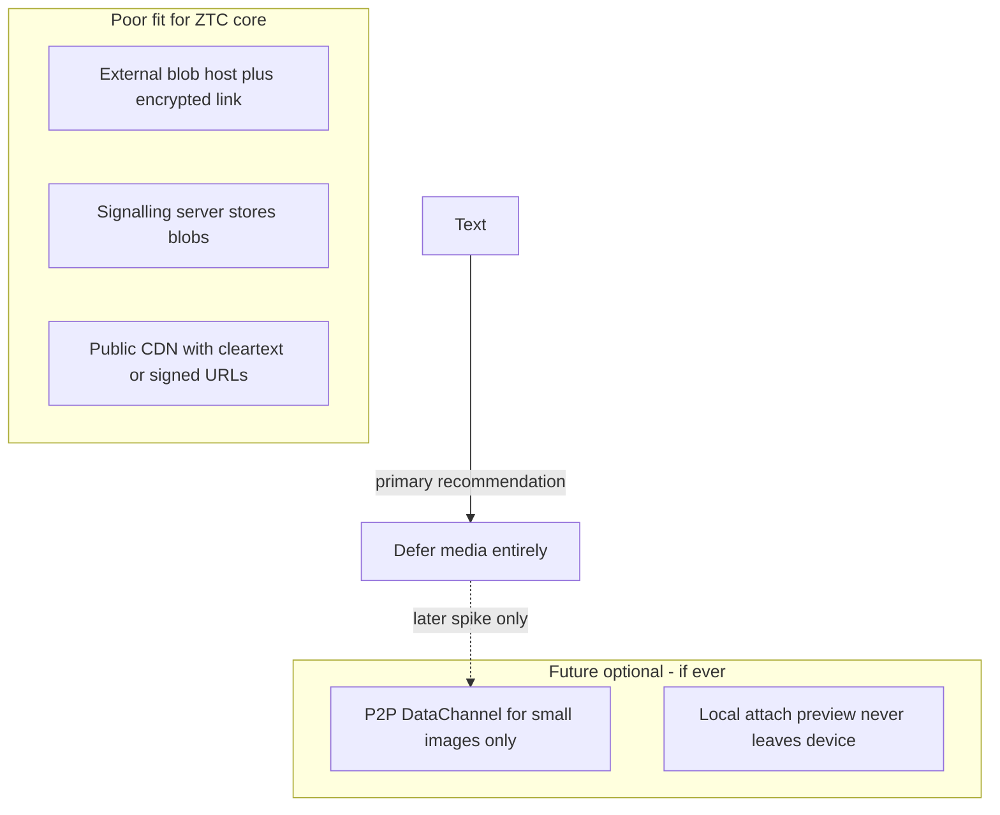

# Media and attachments

Should ZeroTrustChat support images, video, and other files?

**Status: deferred.** Media is **not recommended** for the core prototype. This note explains why, evaluates common approaches (including external encrypted blob hosts), and sketches what a future optional path would need to look like if revisited.

App messages today are text and tiny control messages only ([`appMessage.ts`](../apps/client/src/lib/appMessage.ts)). The README lists voice/video as intentionally not built; [distributed group chat](distributed-group-chat.md) also defers media. Protocol audits already forbid `attachment` / `attachmentPlaintext` field names ([protocol](protocol.md), [privacy model](privacy-model.md)).

## Verdict

| Decision | Guidance |
|----------|----------|
| **Now** | Do **not** implement images/video hosting or P2P media transfer |
| **Keep** | Text/control-only messages; no attachment fields on the wire |
| **If revisited later** | Prefer **1:1 P2P small-image** with hard size caps; never use the signalling server as blob storage; treat external hosts as an explicit opt-in with a separate auditable boundary — still secondary to P2P |

## Philosophy checklist

| Goal | Plain P2P media | External encrypted blob host | Notes |
|------|-----------------|------------------------------|--------|
| Devices own data | Fit | Weak | Host holds ciphertext indefinitely unless you add expiry/deletion |
| Server never a mailbox | Fit if only DataChannel | Conflict | Blob host *is* store-and-forward for content |
| Small blast radius | OK (ciphertext on peers) | Worse | Host/CDN sees sizes, timing, IPs; URL leakage |
| Auditable `@ztc/server-interface` only | Needs care | Breaks | Direct `fetch` to S3/IPFS unless a new allowed boundary exists |
| Light traffic | Poor for video | Poor for large files | Group anti-entropy of multi-MB blobs is expensive |
| Offline = local outbox | Fit | Awkward | Offline sender must upload somewhere or wait for P2P |

## Options considered

### 1. External host + encrypted file + share link

**Idea:** Encrypt the file locally (AES-GCM). Upload opaque bytes to an external host. Put the URL (and wrap the content key) in a normal chat message. Recipient fetches and decrypts.

This is a common pattern in E2E messengers that still rely on cloud object storage. It does **not** fit ZeroTrustChat’s base idea well:

- Reintroduces a **durable third-party content store** (a mailbox for blobs).
- Creates **fetch metadata** (who downloads what, when, from where).
- **URL leakage** plus key material (or a sealed key in the message) can expose content outside the intended peer graph.
- Expands the **network boundary** beyond signalling — client modules would need `fetch` to a blob host unless a new auditable interface wraps it.
- In groups, gossip/anti-entropy can **amplify** downloads and bandwidth.

**When it might be tolerable later:** an explicit, user-enabled “untrusted blob mirror” capability that is never required for text chat, with its own allowlisted boundary package. Still not recommended for v1.

### 2. P2P DataChannel transfer of small images (best fit if anything)

Same path as messages: encrypt locally, send on the WebRTC DataChannel, keep a local outbox if the peer is offline, never upload to the signalling server.

Constraints that would be required:

- Hard size caps (e.g. ≤256–512 KB compressed stills).
- **No video** in the first cut.
- Prefer **1:1** only; avoid group fanout/gossip of full blobs (or treat media as out-of-band relative to text anti-entropy).
- Chunking, progress UI, and careful local storage limits (sql.js / IndexedDB).

Fits the privacy model better than an external host; still costs bandwidth and local storage.

### 3. Signalling / ZTC server stores blobs

**Reject.** Explicit mailbox territory — forbidden by protocol and threat model.

### 4. Local-only attachments

Paste or pick an image that never leaves the device. Harmless but not messaging. Skip unless there is a clear notes-to-self need.

## Future sketch: 1:1 P2P small image (not implemented)

If media is ever revisited, the philosophy-aligned spike would look like:

1. Sender compresses/resizes locally under a hard byte cap.
2. Encrypt with a per-blob AES-256-GCM key (same family as message crypto in `@ztc/crypto`).
3. Send ciphertext chunks over an existing DataChannel (new envelope kind, e.g. `media_chunk`) — **not** via `intro_*` or signalling relay.
4. Receiver reassembles, decrypts, stores locally with the same expiry/retention policies as messages where applicable.
5. Offline: ciphertext stays in a **local** outbox; never uploaded to the signalling server.
6. Groups: either unsupported, or only after a separate design that does not flood the sparse mesh with multi-hundred-KB payloads every anti-entropy round.

External blob hosts remain out of scope for that spike unless promoted to an explicit optional capability with its own threat write-up.

## Explicit non-goals

- Video file sharing or streaming
- Voice/video calling (already intentionally not built)
- Group gossip / anti-entropy of large media blobs
- Signalling server, CDN, or “helpful” third-party as a content mailbox
- Cleartext image URLs in chat
- Changing privacy audits to allow `attachmentPlaintext` on the wire

## See also

- [Privacy model](privacy-model.md)
- [Threat model](threat-model.md)
- [Protocol](protocol.md)
- [Architecture](architecture.md)
- [Distributed group chat](distributed-group-chat.md)
