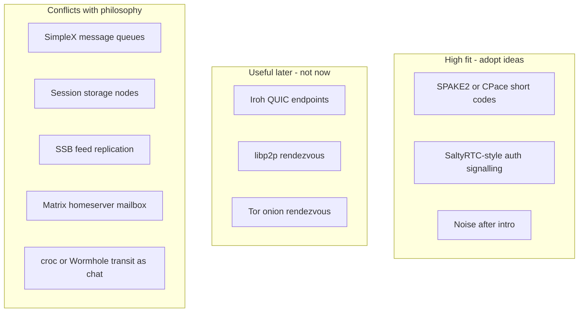

# Related technologies

Survey of external projects and protocols that resemble or could inform ZeroTrustChat, judged against this project's privacy philosophy. **This document is research and design guidance — not an implementation checklist.**

## Philosophy checklist (what “fits” means)

A technology fits ZeroTrustChat only if it preserves all of the following:

1. **Devices own data** — identities, keys, contacts, conversations, messages, group state live on the client.
2. **Server is signalling / rendezvous only** — never a durable chat mailbox; offline peers must not cause message upload.
3. **Offline = local outbox** — ciphertext stays on the sender until P2P delivery or local expiry ([privacy model](privacy-model.md)).
4. **Auditable network boundary** — all infrastructure traffic crosses `@ztc/server-interface`.
5. **Light traffic** — no always-on sync, analytics, or unnecessary polling (see also [threat model](threat-model.md) metadata notes).

Today’s peer invite is a long out-of-band blob (`ztc1:…`) that embeds `peerId` and public keys ([`encodeInvitation` / `decodeInvitation`](../apps/client/src/lib/store.ts)). That is usable for copy/paste and QR, but it does **not** authenticate the first signalling exchange against a malicious or compromised rendezvous server.

## Magic Wormhole

### What it is

[Magic Wormhole](https://magic-wormhole.readthedocs.io/en/latest/) (Python `magic-wormhole`, with [wormhole-william](https://github.com/psanford/wormhole-william) in Go and [magic-wormhole.rs](https://github.com/magic-wormhole/magic-wormhole.rs) in Rust) establishes a **one-shot secure channel** between two peers who share a short human code (for example `7-guitarist-revenge`).

### How it works

1. A **mailbox / rendezvous server** (WebSocket; historically `relay.magic-wormhole.io`) allocates a **nameplate** (the leading number) that points at a short-lived mailbox.
2. The spoken code = nameplate + low-entropy password words from a wordlist. Both sides claim the same nameplate and open the mailbox.
3. Clients run **SPAKE2** (a balanced [PAKE](https://en.wikipedia.org/wiki/Password-authenticated_key_agreement)) over mailbox messages. Success yields a full-strength shared key; later phases are encrypted with keys derived from that secret. The server never learns the key.
4. Bulk transfer uses a separate **transit** path (direct TCP when possible, else a TURN-like transit relay carrying ciphertext only).

PAKE property: an active MitM gets roughly **one password guess** per code use; a wrong guess typically fails both sides. Default code entropy is modest (~16 bits with two words); length is configurable.

Primary sources:

- [Magic Wormhole docs](https://magic-wormhole.readthedocs.io/en/latest/)
- [Mailbox / server protocol](https://magic-wormhole.readthedocs.io/en/latest/server-protocol.html)
- [Protocols repo](https://github.com/magic-wormhole/magic-wormhole-protocols)
- [Python client](https://github.com/magic-wormhole/magic-wormhole)
- [Mailbox server](https://github.com/magic-wormhole/magic-wormhole-mailbox-server)
- [Transit relay](https://github.com/magic-wormhole/magic-wormhole-transit-relay)

### Fit for ZeroTrustChat

| Wormhole piece | Fit | Notes |
|----------------|-----|--------|
| Short codes + PAKE | **Strong** | Better invite UX; authenticates intro against a malicious signalling server |
| Short-lived intro mailbox | **Conditional** | OK only for one-shot intro packets with aggressive TTL, then tear-down — **not** chat |
| Transit relay for files | **Reject for chat** | Would recreate a content-relay / mailbox path |
| Public `wormhole.io` dependency | **Avoid in production** | Keep ZTC’s own signed-manifest signalling servers |

Wormhole’s mailbox is **not** a chat history store, but it *is* store-and-forward of intro ciphertext until both peers meet. That is closer than ZTC’s hard “no mailbox” rule for messages, yet compatible if used **only** for one-shot introduction.

**Do not** vendor the Python client, depend on the public Wormhole relay for production, or use transit relays as an ongoing chat path.

**Do** steal the UX and crypto idea: short human codes + PAKE over ZTC’s existing signalling WebSocket, then normal WebRTC DataChannels.

## Cousins and alternatives



### High fit — adopt ideas (not necessarily the codebases)

| Tech | Role | Why it fits ZTC |
|------|------|-----------------|
| **Wormhole / [croc](https://github.com/schollz/croc) UX** | Human-speakable pairing codes | Same “say a code aloud” intro pattern; croc is Wormhole-*inspired*, not protocol-compatible |
| **[CPace](https://datatracker.ietf.org/doc/draft-irtf-cfrg-cpace/)** (CFRG balanced PAKE) | Derive strong key from short shared secret | Symmetric peer roles match ZTC; JS option [`@cipherman/pake-js`](https://www.npmjs.com/package/@cipherman/pake-js) on `@noble/curves` (same family as `@ztc/crypto`) |
| **SPAKE2** ([RFC 9382](https://www.rfc-editor.org/rfc/rfc9382) / Wormhole classic) | Same PAKE job | Proven in the wild; wormhole-william is a solid reference implementation |
| **[SaltyRTC](https://github.com/saltyrtc/saltyrtc-meta)** | Authenticated WebRTC signalling over an untrusted server | Closest protocol cousin: OOB shared secret → encrypt/authenticate signalling |
| **[Noise Protocol](https://noiseprotocol.org)** | Post-intro channel handshake patterns | Complements PAKE intro; does not replace short-code rendezvous |

### Defer — interesting, heavier or different stack

| Tech | Why defer |
|------|-----------|
| **[Iroh](https://www.iroh.computer/)** | Excellent QUIC P2P + cheap relays; native-first, not the current WebRTC browser prototype |
| **[libp2p rendezvous / DHT](https://docs.libp2p.io/concepts/discovery-routing/rendezvous/)** | Discovery by peer ID, not short PAKE codes; more infrastructure surface |
| **Tor onion services** | Strong metadata story; long addresses and operational cost |

### Reject / poor fit for the chat path

| Tech | Conflict with ZTC |
|------|-------------------|
| **[SimpleX](https://simplex.chat/)** invite links | Servers hold message queues (even if in-memory / unidirectional) |
| **[Session](https://getsession.org/)** | Onion storage nodes hold ciphertext for offline delivery |
| **Secure Scuttlebutt / Bitmessage** | Store-and-forward social / broadcast networks |
| **Matrix homeserver** | Canonical server-side message mailbox |
| **Wormhole transit / croc relay as ongoing chat** | Content through a third-party relay |

## Recommendations

| Decision | Action |
|----------|--------|
| **Adopt (ideas)** | Wormhole-style short codes + CPace (preferred) or SPAKE2 for **one-shot peer introduction** on ZTC’s own signalling WebSocket |
| **Adopt (ideas)** | SaltyRTC-style “signalling is untrusted; authenticate with OOB secret” posture for SDP/ICE after intro |
| **Defer** | Iroh / libp2p / Tor as alternate transports |
| **Reject** | Chat mailboxes, transit relays for messages, SimpleX/Session/SSB/Matrix-style store-and-forward for ZTC chat |
| **Keep** | Long `ztc1:` invites as fallback for air-gapped / QR paste |

## Future sketch: `intro_pake` (not implemented)

Goal: replace trust-in-paste for the *first* contact with a Wormhole-like spoken code, without adding a chat mailbox or new always-on traffic.

```mermaid
sequenceDiagram
  participant A as Alice
  participant S as ZTC_signalling
  participant B as Bob
  A->>A: Create short code nameplate_words
  A->>S: Claim intro nameplate TTL_short
  Note over A,B: Speak or type 4-purple-sausages
  B->>S: Join same nameplate
  A->>S: CPace message 1 opaque
  S->>B: Relay opaque intro frame
  B->>S: CPace message 2 opaque
  S->>A: Relay opaque intro frame
  Note over A,B: Shared key K from CPace
  A->>S: Encrypted peerId and identity keys under K
  S->>B: Relay
  B->>S: Encrypted peerId and identity keys under K
  S->>A: Relay
  Note over A,B: Release nameplate; normal WebRTC via signalling
  A<<->>B: DataChannel chat as today
```

### Mapping to today’s protocol

| Step | Possible ZTC surface | Constraint |
|------|----------------------|------------|
| Nameplate claim / join | New `intro_*` client types **or** reuse `publish_ephemeral_key` / `relay_packet` with a dedicated keyId namespace | Aggressive TTL; no message tables; release after success or timeout |
| PAKE frames | Opaque ciphertext only (same audit rules as today — no plaintext fields) | Server must not parse PAKE internals |
| Identity exchange | Encrypt `peerId` + X25519 / Ed25519 public keys under the PAKE session key | Replaces trusting raw `ztc1:` against MitM on signalling |
| After success | Existing `request_peer` + `signalling` (SDP/ICE) + WebRTC DataChannel | Intro path must not carry chat plaintext or history |
| Fallback | Keep `ztc1:` encode/decode | Offline / QR / air-gapped exchange |

### Traffic and threat notes

- **Cost:** a few kilobytes once while both peers are online — same order as today’s invite + connect, not a new polling loop.
- **MitM:** active attacker on signalling gets ~one code guess; wrong guess should abort both sides (Wormhole “scary” / crowded semantics).
- **Still visible to server:** that two peers claimed a nameplate and exchanged opaque blobs (timing / size metadata) — same class of leak as today’s session and signalling metadata ([threat model](threat-model.md)).
- **Still out of scope:** compromised client device, screenshots, and any transit-relay chat path.

### Explicit non-goals for an `intro_pake` prototype

- Depending on `relay.magic-wormhole.io` or shipping a Wormhole mailbox server as a product requirement
- Using Wormhole transit / croc relay for message delivery
- Replacing app-level AES-GCM or WebRTC DataChannels
- Push notifications, presence UI, or production TURN

## See also

- [Architecture](architecture.md)
- [Protocol](protocol.md)
- [Privacy model](privacy-model.md)
- [Threat model](threat-model.md)
- [Distributed group chat](distributed-group-chat.md)
- [Third-party servers](third-party-servers.md)
